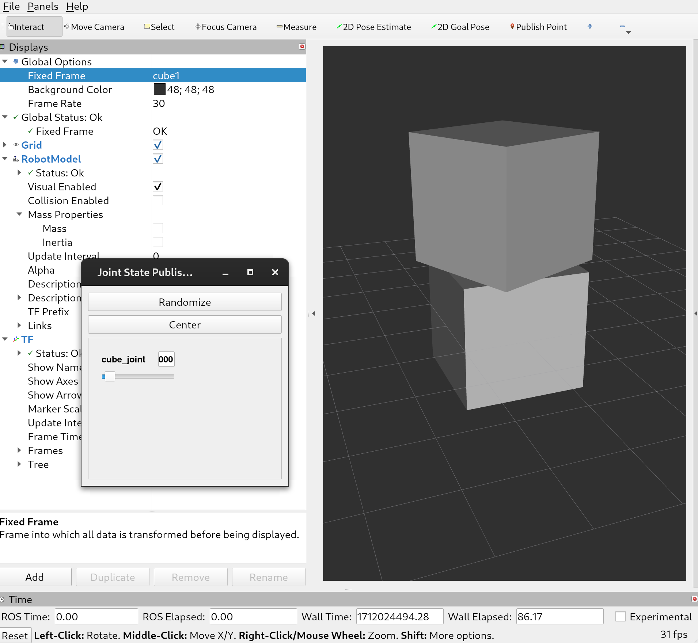

# view_sdf_rviz

View SDF models on RViz.


Requirements
- ROS 2 Rolling/Iron/Humble

## Setup

Create a ROS 2 workspace.
```bash
mkdir ~/ws/src -p
cd ~/ws/src
git clone https://github.com/yadunund/view_sdf_rviz
```

Next prepare the `models` folder in this package as per [guide](models/README.md).

Build the workspace
```bash
cd ~/ws
source /opt/ros/<ROS_DISTRO>/setup.bash # replace <ROS_DISTRO> with version of ROS 2 installed
rosdep install --from-paths src --ignore-src --rosdistro $ROS_DISTRO -y
colcon build
```

## Usage
```bash
cd ~/ws
source install/setup.bash
ros2 launch view_sdf_rviz view_sdf.launch.py sdf_file:=src/view_sdf_rviz/models/Cubes/model.sdf # Replace with path to your model.
```

RViz should open up with the model visualized. Make sure to set the global frame to one of the links in the model.
